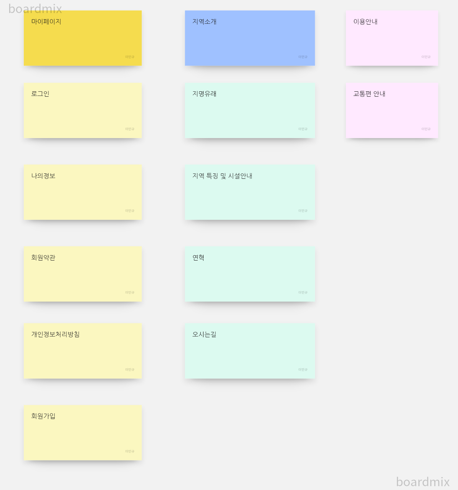

# 프로젝트 개발보고서(Project Development Report) 
-----------------------------------------
## 1. 프로젝트 개요(Project Outline)

    서울디지털다지가 조성되어있어
    어쩌구 저쩌구
    introduce

 

## 2. 프로젝트 목적(Project Purspose)

    프로젝트의
    목적
    이거쿵

 

## 3. 프로젝트 개발 환경 정보(Project Dvelopment Environment)

  -  Project Dvelopement infromation
   - Project Topic : Gasan-dong intro Web Application
  -  Develop Environment : Open JDK 11
  -  Language : java 11
  -  Web Module : Jsp/Servlet 3.0
  -  Process pattern : MVC Pattern
  -  Database System(DBMS) : Oracle 21C XE
  -  Database Design : SQL Developer 23.1.1
  -  Entity Realationship Design : draw.io 20.8.16
  -  Java Database Connector : ojdbc11
 -   Application Design : Object aid 1.2.4
   - Back Template Language : java/Servlet 11
  -  Front Template Language : Jsp(JSTL/EL) 3.0/HTMS5/CSS3/Javascript ES5
   - Web (Application) Server : Tomcat 9.0
    Package Information

 

## 4. 프로젝트 기획 및 설계(Project Planning & Design)

### 4-1. 네비게이션 설계(Navigation Design)

| 마이페이지 | 지역소개 | 이용안내 | 커뮤니티 |
|-----------|---------|----------|---------|
| 로그인 | 지명유래 |  교통편안내 | 공지사항 |
| 나의정보 | 특징 및 시설안내 | 빌딩안내 | 문답 |
| 회원가입 | &nbsp; | 숙박시설안내 | &nbsp; |

  

#### 4-1-1. 자료수집 (Data CollectionAnd Sort)-WordCloud

  

#### 4-1-2. 콘텐츠 분류(Content Cort)-Card Sorting

  

#### 4-1-3. 서비스 흐름 설계(Service Flow Design)

  

#### 4-1-4. 서비스 시나리오(Service User Scenario)

**회원/비회원 사용자 시나리오(Member User Scenario)**

1. 
2. 
3. 
4. 

**관리자 시나리오(Administrator Scenario)**

### 4-2. 데이터베이스 설계

#### 4-2-1. 계념적 설계

  

#### 4-2-2. 논리적 설계

  

#### 4-2-3. 물리적 설계

  